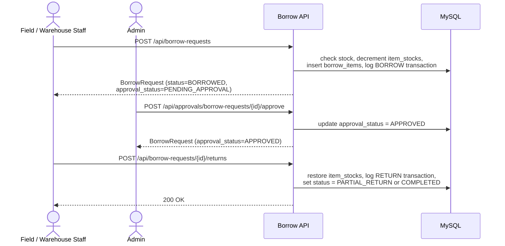
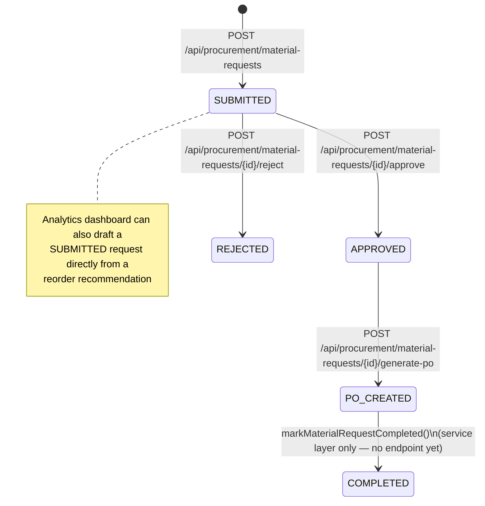
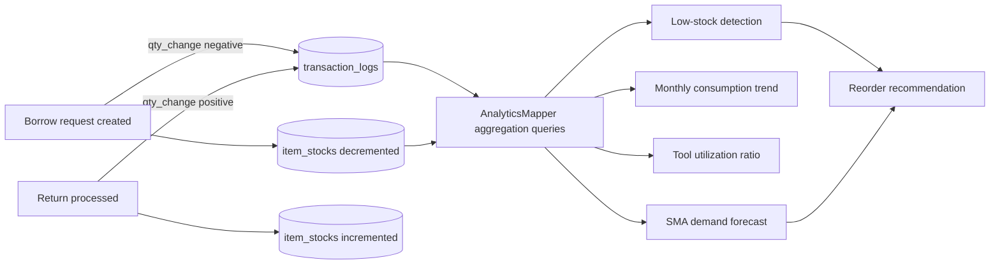
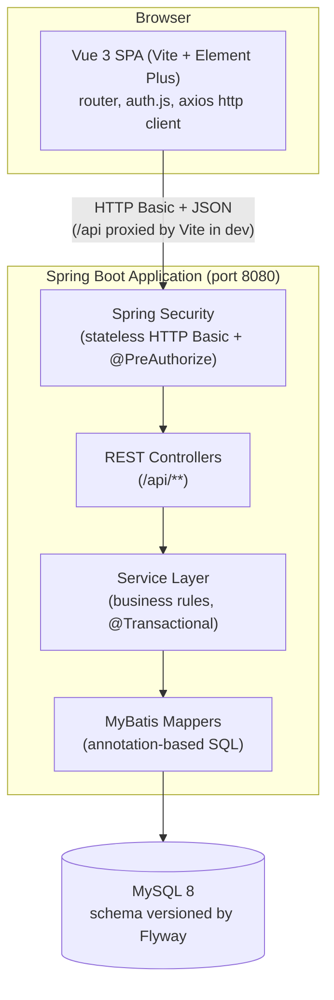
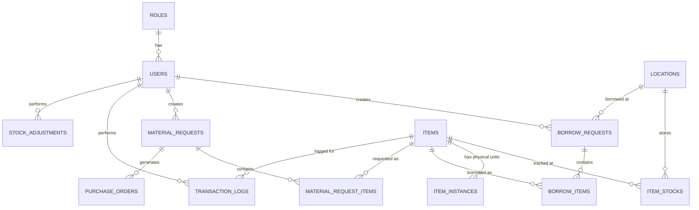

# SiteFlow

**Site Material & Tool Management System**

SiteFlow is a full-stack web application for tracking construction-site materials and tools: who has what, where it is, how much stock is left, and what needs to be reordered. It replaces the spreadsheet-based tracking commonly used on small-to-mid-size construction sites with a role-based web application backed by a relational database, covering inventory, tool borrowing/return, an admin approval workflow, individually tracked tool instances, a material-request-to-purchase-order procurement pipeline, and a small analytics dashboard built on top of the transaction history.

This is a personal software engineering project. It models a real-world operational problem (site logistics on construction projects) but contains no real company data, real inventory, or real business information — all seed data is synthetic.

---

## Table of Contents

- [Problem Statement](#problem-statement)
- [Core Features](#core-features)
- [Core Workflows](#core-workflows)
- [System Architecture](#system-architecture)
- [Tech Stack](#tech-stack)
- [Project Structure](#project-structure)
- [Database](#database)
- [Setup Requirements](#setup-requirements)
- [Environment Variables](#environment-variables)
- [Running Locally](#running-locally)
- [API Overview](#api-overview)
- [Screenshots](#screenshots)
- [Testing](#testing)
- [Privacy & Data Governance](#privacy--data-governance)
- [Roadmap](#roadmap-planned--not-implemented)
- [License](#license)
- [Development Notes](#development-notes)

---

## Problem Statement

On many construction sites, tools and materials are still tracked with paper logbooks or shared spreadsheets: a worker borrows a drill and writes their name on a sheet, a supervisor eyeballs the consumables shelf to decide what to reorder, and nobody has a reliable answer to "how many safety gloves do we actually have across all sites right now?" This creates a few recurring problems:

- **No single source of truth for stock.** Quantities live in someone's head or a spreadsheet that's rarely in sync with the storage room.
- **No accountability for borrowed tools.** It's hard to know who currently has a specific tool, whether it came back, or what condition it came back in.
- **Reordering is reactive.** Low stock is usually noticed after it becomes a problem, not before.
- **Procurement has no audit trail.** Turning "we need more of X" into an actual purchase order is an informal, manual process.

SiteFlow addresses this by giving each of these workflows a structured, role-gated web interface backed by a real schema: item stock is tracked per location, every borrow/return writes an auditable transaction log, borrow requests go through an explicit approval step before dispensing, individual tools can be tracked by serial number/QR code with a condition state, and material requests can be turned into purchase orders through a defined status pipeline. An analytics layer reads that transaction history to surface low-stock items and a simple demand forecast, rather than requiring someone to notice a shortage manually.

## Core Features

All features below are implemented in the current codebase (backend + frontend), unless explicitly marked otherwise. See [Roadmap](#roadmap-planned--not-implemented) for what is *not* built yet.

| Feature | Description |
|---|---|
| **Authentication** | Stateless HTTP Basic authentication backed by Spring Security. Credentials are checked against the `users` table (BCrypt-hashed passwords); the frontend stores the Basic-auth token client-side for the session and resolves the user's role via `GET /api/auth/me` after login. |
| **Role-based access control** | Three roles are seeded: `ADMIN`, `WAREHOUSE_STAFF`, `FIELD_STAFF`. Every backend endpoint is annotated with `@PreAuthorize`, and the frontend router additionally hides/blocks role-restricted views (e.g. Approvals, Analytics are ADMIN-only). |
| **Inventory management** | Item catalog (`TOOL` / `CONSUMABLE` / `LIFTING_GEAR`) with per-location stock quantities and a configurable minimum-stock threshold per item. |
| **Tool borrowing & return** | Field/warehouse staff submit a borrow request for one or more items at a location; stock is checked and decremented, and a transaction log entry is written. Returns are processed per line item and update stock and request status (`PARTIAL_RETURN` / `COMPLETED`) accordingly. |
| **Approval workflow** | Every borrow request is created in a `PENDING_APPROVAL` state. An admin dashboard (`ApprovalDashboard.vue`) lists pending requests and lets an admin approve or reject them; rejection requires a mandatory note. |
| **Asset tracking (individual tool instances)** | Physical tools can be registered as individually tracked `item_instances` with a unique serial number and QR code value. A scanner-style UI (`AssetScanner.vue`) checks tools out against an approved borrow request and processes returns with a condition inspection (`GOOD` / `NEEDS_REPAIR` / `BROKEN`). |
| **Material requests** | Workers/supervisors submit a material request with one or more line items (item + quantity) and a justification. |
| **Procurement / purchase orders** | An admin can approve or reject a submitted material request (rejection requires a mandatory note), and can list approved requests and generate a purchase order from one, which auto-generates a PO number and issues the order. |
| **Analytics dashboard** | Read-only aggregation layer over the transaction log and stock tables: dashboard summary metrics, low-stock detection, monthly consumption trends for consumables, tool utilization (borrowed vs. owned), and a simple moving-average demand forecast per item, with a reorder-recommendation report that can draft a material request directly from the UI. |

## Core Workflows

### Tool Borrowing Workflow

Stock is checked and reserved at the moment the request is created, not at approval time — the approval step records a decision but does not itself move stock.



### Material Request & Procurement Workflow



### Inventory Transaction Workflow

Every stock-affecting action (borrow, return) writes an entry to `transaction_logs` with a signed `qty_change`. The analytics layer reads exclusively from this log and from `item_stocks` — it does not maintain separate counters.



## System Architecture

SiteFlow is a classic three-tier web application: a Vue single-page application talking to a Spring Boot REST API, which persists to MySQL through MyBatis. There is no separate API gateway, message queue, or caching layer.



- **Frontend**: Vue 3 (Composition API) SPA using Element Plus for UI components, Vue Router for navigation and role-gated routes, and a single Axios instance (`src/api/http.js`) that attaches the Basic-auth header and centralizes error-toast handling.
- **Backend**: Spring Boot REST API. Controllers are thin and delegate to a service layer that owns transaction boundaries and business rules; services talk to the database exclusively through MyBatis mapper interfaces (no JPA/Hibernate is used).
- **Database**: MySQL, schema and seed data versioned through Flyway migrations that run automatically on application startup.
- **Auth**: Stateless HTTP Basic authentication — there is no session store and no JWT; every request is authenticated independently against the `users` table.

## Tech Stack

**Backend** (`pom.xml`, Spring Boot parent `3.5.0`):

| Component | Technology |
|---|---|
| Language / runtime | Java 25 |
| Framework | Spring Boot 3.5.0 (`spring-boot-starter-web`, `spring-boot-starter-validation`) |
| Security | Spring Security (`spring-boot-starter-security`), stateless HTTP Basic, BCrypt password hashing |
| Persistence | MyBatis (`mybatis-spring-boot-starter` 3.0.4), annotation-based mappers (no XML) |
| Database driver | `mysql-connector-j` |
| Schema migrations | Flyway (`flyway-core`, `flyway-mysql`) |
| Boilerplate reduction | Lombok |
| Build tool | Maven |
| Testing | JUnit 5, Spring Boot Test, MockMvc, `spring-security-test` |

**Frontend** (`frontend/package.json`):

| Component | Technology |
|---|---|
| Framework | Vue 3.5.13 (Composition API, `<script setup>`) |
| Build tool | Vite 6.0.7 (`@vitejs/plugin-vue` 5.2.1) |
| Routing | Vue Router 4.5.0 |
| UI library | Element Plus 2.9.1 |
| HTTP client | Axios 1.7.9 |
| Charting | Chart.js 4.5.1 + vue-chartjs 5.3.4 (used only in the analytics dashboard's trend chart) |

## Project Structure

```
siteflow/
├── pom.xml                              # Maven build, Spring Boot 3.5.0, Java 25
├── src/
│   ├── main/java/com/siteflow/
│   │   ├── SiteflowApplication.java     # Spring Boot entry point
│   │   ├── controller/                  # REST controllers (@RestController, @PreAuthorize)
│   │   ├── service/                     # Business logic, @Transactional boundaries
│   │   ├── mapper/                      # MyBatis @Mapper interfaces (annotation-based SQL)
│   │   ├── domain/                      # Persistence-mapped entities (Lombok @Data/@Builder)
│   │   │   └── enums/                   # ItemCategory, BorrowStatus, ApprovalStatus, etc.
│   │   ├── web/
│   │   │   ├── ApiResponse.java         # Standard {status, message, data} envelope
│   │   │   ├── GlobalExceptionHandler.java
│   │   │   └── dto/                     # Request DTOs and read-only projection views
│   │   └── security/                    # SecurityConfig, UserPrincipal, DbUserDetailsService
│   └── main/resources/
│       ├── application.yml              # Datasource, Flyway, MyBatis configuration
│       └── db/migration/                # Flyway migrations V1–V5 (schema + seed data)
├── src/test/java/com/siteflow/
│   ├── SiteflowApplicationTests.java    # Spring context load smoke test
│   └── controller/                      # MockMvc controller tests (Approval, AssetTracking, Procurement)
└── frontend/
    ├── src/
    │   ├── views/                       # One .vue file per screen (Login, Inventory, Borrow, Approvals, Assets, Procurement, Analytics)
    │   ├── router/index.js              # Routes + role-based navigation guard
    │   ├── api/http.js                  # Axios instance, auth header, centralized error toasts
    │   ├── auth.js                      # Client-side auth/session state (sessionStorage)
    │   └── App.vue                      # Shell layout + role-gated nav menu
    └── vite.config.js                   # Dev server + /api proxy (VITE_API_PROXY_TARGET, default localhost:8080)
```

## Database

The schema is defined entirely through Flyway migrations (`src/main/resources/db/migration/V1__init_schema.sql` through `V7__material_request_approval_audit.sql`). All tables use `BIGINT UNSIGNED` surrogate keys and `InnoDB`/`utf8mb4`.



Key entities:

- **`users` / `roles`** — one role per user (`ADMIN`, `WAREHOUSE_STAFF`, `FIELD_STAFF`), BCrypt password hash.
- **`items` / `item_stocks` / `locations`** — item catalog with per-location quantities and a `min_stock_threshold` used by the low-stock and reorder logic.
- **`item_instances`** — individually tracked physical tools (serial number, QR code, `tool_condition`), added in the V2 schema for asset tracking.
- **`borrow_requests` / `borrow_items`** — a request header plus one row per borrowed item, with `qty_borrowed`/`qty_returned` tracked per line; the header carries both a fulfillment `status` (`PENDING` / `BORROWED` / `PARTIAL_RETURN` / `COMPLETED`) and an `approval_status` (`PENDING_APPROVAL` / `APPROVED` / `REJECTED`).
- **`transaction_logs`** — an append-only ledger of every stock-affecting movement (`BORROW`, `RETURN`, `ADJUSTMENT`) with a signed `qty_change`; this is the single source of truth the analytics module reads from.
- **`stock_adjustments`** — manual IN/OUT stock corrections, each one also recorded as an `ADJUSTMENT` row in `transaction_logs`.
- **`material_requests` / `material_request_items` / `purchase_orders`** — the procurement pipeline described above.

## Setup Requirements

- **Java 25** (as pinned in `pom.xml`) — a matching JDK must be installed and on `JAVA_HOME`/`PATH`.
- **Maven 3.9+** — no Maven Wrapper (`mvnw`) is checked into the repository, so a local Maven installation is required.
- **MySQL 8.0+** — the schema uses the `utf8mb4_0900_ai_ci` collation, which requires MySQL 8.0 or newer.
- **Node.js 18+** (not explicitly pinned in `package.json`, but required by Vite 6) and **npm**.

## Environment Variables

`src/main/resources/application.yml` resolves every datasource and server setting from OS environment variables via `${VAR:default}` placeholders — no credentials are hardcoded or committed. Copy [`.env.example`](.env.example) for a documented list of what to set; Spring Boot does not load `.env` files itself, so export these in your shell profile, IDE run configuration, or process manager.

| Variable | Default | Description |
|---|---|---|
| `DB_HOST` | `localhost` | MySQL host |
| `DB_PORT` | `3306` | MySQL port |
| `DB_NAME` | `siteflow` | MySQL schema/database name |
| `DB_USERNAME` | `root` | MySQL username |
| `DB_PASSWORD` | *(none — required)* | MySQL password. The app fails to start with a clear error if this isn't set; there is deliberately no default. |
| `SERVER_PORT` | `8080` | Port the Spring Boot application listens on |

The frontend has its own, separate `.env.example` under [`frontend/`](frontend/.env.example) — see [Running Locally](#running-locally).

Example local configuration:

```bash
export DB_HOST=localhost
export DB_PORT=3306
export DB_NAME=siteflow
export DB_USERNAME=root
export DB_PASSWORD=your-local-mysql-password
export SERVER_PORT=8080
```

## Running Locally

### Backend (Spring Boot API)

```bash
# 1. Create a local MySQL database (name must match DB_NAME, default "siteflow")
mysql -u root -p -e "CREATE DATABASE siteflow;"

# 2. Set DB_USERNAME/DB_PASSWORD (and DB_HOST/DB_PORT/DB_NAME if you're not using the
#    defaults) for your local MySQL instance — see .env.example and Environment
#    Variables above. Export them in your shell, or set them in your IDE's run
#    configuration; this project does not read a .env file automatically.
export DB_USERNAME=root
export DB_PASSWORD=your-local-mysql-password

# 3. Run the API — Flyway applies all migrations and seed data automatically on startup
mvn spring-boot:run
```

The API starts on `http://localhost:8080` (or `SERVER_PORT` if set). Three dev accounts are seeded by `V3__seed_users.sql` (`admin`, `gudang`, `pekerja` — one per role) with BCrypt-hashed passwords; see that migration file for details before using them.

### Frontend (Vue 3 SPA)

```bash
cd frontend
npm install
npm run dev
```

The Vite dev server proxies any request to `/api` through to `http://localhost:8080` by default (see `frontend/vite.config.js`), so the backend must be running first. If your backend runs on a different host/port, copy [`frontend/.env.example`](frontend/.env.example) to `frontend/.env.local` and set `VITE_API_PROXY_TARGET` accordingly — Vite loads `.env*` files automatically, no extra setup needed. For a production build:

```bash
npm run build
```

## API Overview

All endpoints are under `/api`, secured with HTTP Basic auth, and return the standard envelope `{ "status", "message", "data" }` (`ApiResponse<T>`). Role restrictions are enforced with `@PreAuthorize`.

| Area | Endpoint | Roles |
|---|---|---|
| Auth | `GET /api/auth/me` | any authenticated user |
| Inventory | `GET /api/items` | ADMIN, WAREHOUSE_STAFF, FIELD_STAFF |
| Inventory | `GET /api/items/{id}/stocks` | ADMIN, WAREHOUSE_STAFF |
| Locations | `GET /api/locations` | ADMIN, WAREHOUSE_STAFF, FIELD_STAFF |
| Borrowing | `POST /api/borrow-requests` | ADMIN, FIELD_STAFF |
| Borrowing | `POST /api/borrow-requests/{id}/returns` | ADMIN, WAREHOUSE_STAFF, FIELD_STAFF |
| Approvals | `GET /api/approvals/borrow-requests/pending` | ADMIN |
| Approvals | `POST /api/approvals/borrow-requests/{id}/approve` | ADMIN |
| Approvals | `POST /api/approvals/borrow-requests/{id}/reject` | ADMIN |
| Asset tracking | `POST /api/assets/checkout` | ADMIN, WAREHOUSE_STAFF |
| Asset tracking | `POST /api/assets/return` | ADMIN, WAREHOUSE_STAFF |
| Stock adjustments | `POST /api/stock-adjustments` | ADMIN, WAREHOUSE_STAFF |
| Procurement | `GET /api/procurement/material-requests?status=` | ADMIN, PROCUREMENT* |
| Procurement | `POST /api/procurement/material-requests` | ADMIN, FIELD_STAFF, WAREHOUSE_STAFF |
| Procurement | `POST /api/procurement/material-requests/{id}/approve` | ADMIN |
| Procurement | `POST /api/procurement/material-requests/{id}/reject` | ADMIN |
| Procurement | `POST /api/procurement/material-requests/{id}/generate-po` | ADMIN, PROCUREMENT* |
| Analytics | `GET /api/analytics/summary` | ADMIN |
| Analytics | `GET /api/analytics/low-stock` | ADMIN |
| Analytics | `GET /api/analytics/trends?startDate=&endDate=` | ADMIN |
| Analytics | `GET /api/analytics/tool-utilization` | ADMIN |
| Analytics | `GET /api/analytics/forecast/{itemId}` | ADMIN |

\* `PROCUREMENT` is referenced in `@PreAuthorize("hasAnyRole('ADMIN', 'PROCUREMENT')")` on the Procurement controller but is **not** one of the three roles seeded by `V3__seed_users.sql`. In the current codebase these endpoints are reachable only by `ADMIN` until a `PROCUREMENT` role is seeded.

## Screenshots

No screenshots are currently included in this repository. *(Placeholder — add UI screenshots here, e.g. `docs/screenshots/inventory.png`, `docs/screenshots/analytics.png`, once available.)*

## Testing

**Backend**: JUnit 5 + Spring Boot Test, using `@SpringBootTest`/`@AutoConfigureMockMvc` with `MockMvc` and `@MockitoBean` to test controllers against mocked services (see `src/test/java/com/siteflow/controller/`). Run with:

```bash
mvn test
```

Current coverage is a context-load smoke test (`SiteflowApplicationTests`) plus MockMvc tests for `ApprovalController`, `AssetTrackingController`, and `ProcurementController`. `InventoryController`, `BorrowController`, `LocationController`, `AuthController`, and `AnalyticsController` do not currently have dedicated test classes.

**Frontend**: no automated test suite is configured — `frontend/package.json` only defines `dev`, `build`, and `preview` scripts. Frontend changes have been verified manually via `npm run build` and manual UI walkthroughs during development.

## Privacy & Data Governance

SiteFlow is engineered with strict **Privacy by Design** principles appropriate for an enterprise construction logistics system:

### 1. Data Minimization & Stored Categories
SiteFlow collects only operational business data necessary to maintain physical equipment custody and warehouse integrity:
- **Identity & Roles**: `username`, `full_name`, `job_position`, and role assignment stored in MySQL `users`. No personal emails, phone numbers, home addresses, government IDs, or biometrics are collected.
- **Authentication**: Salted BCrypt password hashes (cost 10) in `users.password_hash`. Password hashes and secrets are **never** exposed in any API response or DTO.
- **Equipment & Logistics**: Borrow requests, return receipts, material requests, and purchase orders.
- **Audit Ledger**: Append-only `transaction_logs` tracking physical item custody transfers.

### 2. Cookie & Storage Architecture
- **Cookies**: Zero cookies used (`document.cookie` is unused; no tracking or session cookies).
- **Persistent Storage**: No tokens stored in persistent `localStorage`.
- **Session Storage**: A short-lived JWT token is held in `sessionStorage` (`siteflow.auth`) for active tab requests and cleared on logout.
- **Third-Party Trackers**: Zero external trackers, analytics beacons, or remote CDN scripts. All libraries are bundled locally.

### 3. Account Deactivation & Data Anonymization
Hard-deleting user records would cascade or fail against foreign key constraints (`ON DELETE RESTRICT`) on historical borrowing records and transaction logs, corrupting physical tool accountability and safety audit trails.
Instead, SiteFlow implements an **Anonymize & Deactivate** model:
- `POST /api/users/me/deactivate`: Users can request deactivation of their own account with explicit confirmation.
- `POST /api/users/{id}/deactivate`: Administrators can deactivate accounts during employee offboarding.
- The account is disabled (`is_active = FALSE`), credentials are permanently scrambled (`DEACTIVATED_[UUID]`), and identifying information is anonymized (`full_name = 'Anonymized User #[id]'`).
- Subsequent login attempts are immediately blocked with HTTP `401 Unauthorized` (`User account is deactivated.`).
- Historical equipment custody and transaction logs remain referentially valid.

### 4. Privacy Policy & Terms of Service
- Accessible publicly in the frontend via `/privacy` and `/terms` (linked from the login page and application footer).
- Detailed documentation maintained in [`PRIVACY.md`](PRIVACY.md) and [`TERMS.md`](TERMS.md).
- Placeholders requiring organizational confirmation (legal entity name, data governance contact) are clearly documented.

## Roadmap (planned — not implemented)

The following are explicitly **not** implemented yet and are listed here so they aren't mistaken for existing functionality:

- **Material request completion endpoint.** `ProcurementService.markMaterialRequestCompleted()` (PO_CREATED → COMPLETED) exists at the service layer but is not wired to any controller endpoint. (Approval/rejection, SUBMITTED → APPROVED/REJECTED, is implemented and exposed.)
- **A dedicated `PROCUREMENT` role.** Referenced in `@PreAuthorize` annotations but not yet seeded or assignable through any UI/API.
- **Automated frontend testing** (e.g. Vitest for unit tests, Playwright/Cypress for E2E).
- **CI pipeline** (no GitHub Actions workflow currently exists in this repository).
- **Multi-tenant / multi-project support** — the schema currently models a single organization's locations and inventory.
- **Screenshots / demo media** for this README.

## License

No license has been specified for this repository. All rights reserved by default until a license is added.

## Development Notes

- **Flyway** manages the schema end-to-end: `V1__init_schema.sql` (core MVP schema), `V2__seed_reference_data.sql` (roles), `V3__seed_users.sql` (dev accounts), `V4__seed_sample_data.sql` (sample items/locations/stock), `V5__v2_management_schema.sql` (asset tracking, approval workflow columns, procurement pipeline), `V6__improve_schema_integrity_and_indexes.sql` (borrow request timestamps, analytics index), `V7__material_request_approval_audit.sql` (material request approval audit columns and REJECTED status). `baseline-on-migrate` is enabled and migrations run automatically on application startup — there is no manual migration step.
- **MyBatis** is used exclusively (no JPA/Hibernate). Simple CRUD mappers use `@Select`/`@Insert`/`@Update` with `map-underscore-to-camel-case: true`; multi-table read views use `@ConstructorArgs`/`@Arg` to project joined query results directly into Java records (e.g. `ItemSummaryView`, `BorrowRequestView`) without an ORM layer in between.
- **Spring Security** is configured as fully stateless (`SessionCreationPolicy.STATELESS`) with HTTP Basic and CSRF disabled, since there is no server-side session or cookie-based flow — every request re-authenticates against the database via a custom `UserDetailsService`. Method-level authorization uses `@EnableMethodSecurity` with `@PreAuthorize` on every controller method.
- **Transactional workflows**: multi-step writes (creating a borrow request across several items, submitting a material request with line items, generating a purchase order) are wrapped in a single `@Transactional` service method so a failure partway through rolls back the entire operation rather than leaving partial rows.
- **Stock timing in the borrow flow**: stock is decremented and the transaction log written at *request creation* time, not at approval time — the subsequent admin approve/reject step only updates `approval_status` and does not itself move stock. A rejected request does not currently restore the decremented stock automatically.
- **Analytics module**: all aggregation is done in SQL (`AnalyticsMapper`, grouped/`HAVING`/correlated-subquery queries against `transaction_logs`, `item_stocks`, and `item_instances`) rather than in application code, and the demand forecast is a straightforward simple moving average (SMA) over the most recent months of borrow activity per item — not a statistical or ML forecasting model.
