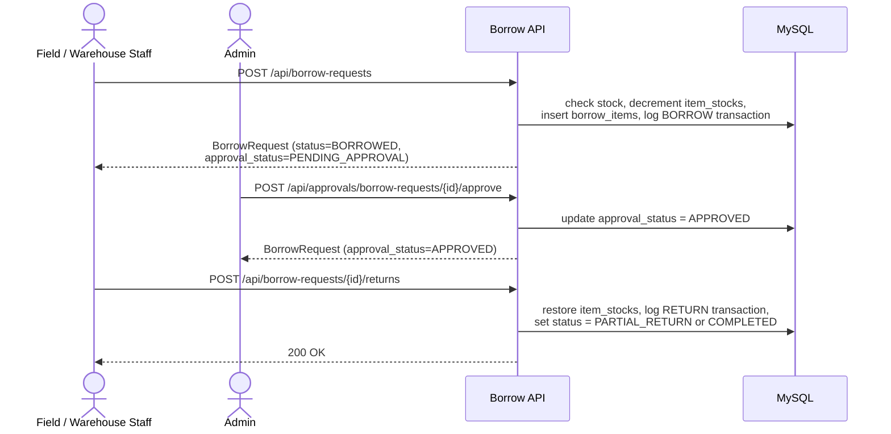
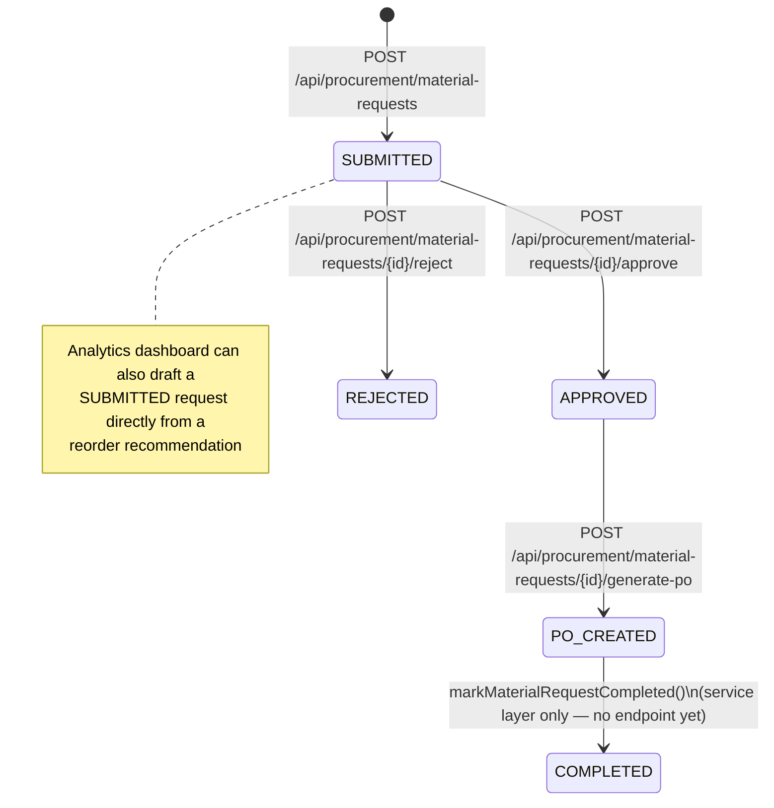
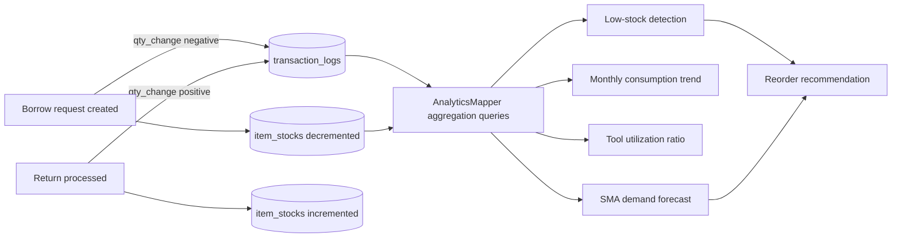
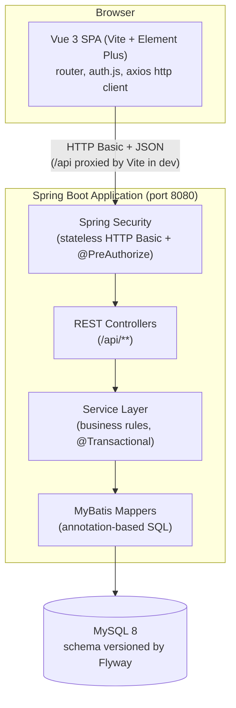
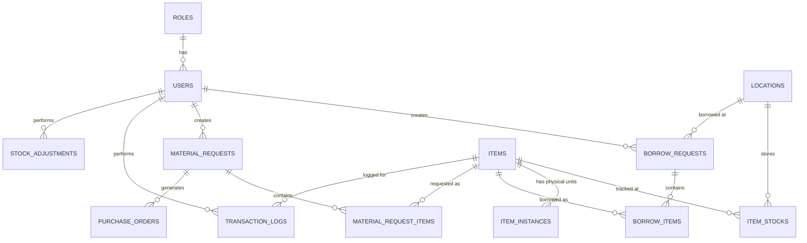

# SiteFlow

**Site Material & Tool Management System**

SiteFlow is a full-stack web application for tracking construction-site materials and tools: who has what, where it is, how much stock is left, and what needs to be reordered. It replaces the spreadsheet-based tracking commonly used on small-to-mid-size construction sites with a role-based web application backed by a relational database, covering inventory, tool borrowing/return, an admin approval workflow, individually tracked tool instances, a material-request-to-purchase-order procurement pipeline, and a small analytics dashboard built on top of the transaction history.

This is a personal software engineering project. It models a real-world operational problem (site logistics on construction projects) but contains no real company data, real inventory, or real business information — all seed data is synthetic.

---

## Table of Contents

- [Problem Statement](#problem-statement)
- [Core Features](#core-features)
- [Core Workflows](#core-workflows)
- [System Architecture](#system-architecture)
- [Tech Stack](#tech-stack)
- [Project Structure](#project-structure)
- [Database](#database)
- [Setup Requirements](#setup-requirements)
- [Environment Variables](#environment-variables)
- [Running Locally](#running-locally)
- [API Overview](#api-overview)
- [Screenshots](#screenshots)
- [Testing](#testing)
- [Privacy & Data Governance](#privacy--data-governance)
- [Accessibility & UX Compliance](#accessibility--ux-compliance-wcag-21-aa)
- [Audit Trail, Accountability & Security Logging](#audit-trail-accountability--security-logging)
- [Software Supply Chain, Dependency, Asset & License Compliance](#software-supply-chain-dependency-asset--license-compliance)
- [Roadmap](#roadmap-planned--not-implemented)
- [License](#license)
- [Development Notes](#development-notes)

---

## Problem Statement

On many construction sites, tools and materials are still tracked with paper logbooks or shared spreadsheets: a worker borrows a drill and writes their name on a sheet, a supervisor eyeballs the consumables shelf to decide what to reorder, and nobody has a reliable answer to "how many safety gloves do we actually have across all sites right now?" This creates a few recurring problems:

- **No single source of truth for stock.** Quantities live in someone's head or a spreadsheet that's rarely in sync with the storage room.
- **No accountability for borrowed tools.** It's hard to know who currently has a specific tool, whether it came back, or what condition it came back in.
- **Reordering is reactive.** Low stock is usually noticed after it becomes a problem, not before.
- **Procurement has no audit trail.** Turning "we need more of X" into an actual purchase order is an informal, manual process.

SiteFlow addresses this by giving each of these workflows a structured, role-gated web interface backed by a real schema: item stock is tracked per location, every borrow/return writes an auditable transaction log, borrow requests go through an explicit approval step before dispensing, individual tools can be tracked by serial number/QR code with a condition state, and material requests can be turned into purchase orders through a defined status pipeline. An analytics layer reads that transaction history to surface low-stock items and a simple demand forecast, rather than requiring someone to notice a shortage manually.

## Core Features

All features below are implemented in the current codebase (backend + frontend), unless explicitly marked otherwise. See [Roadmap](#roadmap-planned--not-implemented) for what is *not* built yet.

| Feature | Description |
|---|---|
| **Authentication** | Stateless HTTP Basic authentication backed by Spring Security. Credentials are checked against the `users` table (BCrypt-hashed passwords); the frontend stores the Basic-auth token client-side for the session and resolves the user's role via `GET /api/auth/me` after login. |
| **Role-based access control** | Three roles are seeded: `ADMIN`, `WAREHOUSE_STAFF`, `FIELD_STAFF`. Every backend endpoint is annotated with `@PreAuthorize`, and the frontend router additionally hides/blocks role-restricted views (e.g. Approvals, Analytics are ADMIN-only). |
| **Inventory management** | Item catalog (`TOOL` / `CONSUMABLE` / `LIFTING_GEAR`) with per-location stock quantities and a configurable minimum-stock threshold per item. |
| **Tool borrowing & return** | Field/warehouse staff submit a borrow request for one or more items at a location; stock is checked and decremented, and a transaction log entry is written. Returns are processed per line item and update stock and request status (`PARTIAL_RETURN` / `COMPLETED`) accordingly. |
| **Approval workflow** | Every borrow request is created in a `PENDING_APPROVAL` state. An admin dashboard (`ApprovalDashboard.vue`) lists pending requests and lets an admin approve or reject them; rejection requires a mandatory note. |
| **Asset tracking (individual tool instances)** | Physical tools can be registered as individually tracked `item_instances` with a unique serial number and QR code value. A scanner-style UI (`AssetScanner.vue`) checks tools out against an approved borrow request and processes returns with a condition inspection (`GOOD` / `NEEDS_REPAIR` / `BROKEN`). |
| **Material requests** | Workers/supervisors submit a material request with one or more line items (item + quantity) and a justification. |
| **Procurement / purchase orders** | An admin can approve or reject a submitted material request (rejection requires a mandatory note), and can list approved requests and generate a purchase order from one, which auto-generates a PO number and issues the order. |
| **Analytics dashboard** | Read-only aggregation layer over the transaction log and stock tables: dashboard summary metrics, low-stock detection, monthly consumption trends for consumables, tool utilization (borrowed vs. owned), and a simple moving-average demand forecast per item, with a reorder-recommendation report that can draft a material request directly from the UI. |

## Core Workflows

### Tool Borrowing Workflow

Stock is checked and reserved at the moment the request is created, not at approval time — the approval step records a decision but does not itself move stock.



### Material Request & Procurement Workflow



### Inventory Transaction Workflow

Every stock-affecting action (borrow, return) writes an entry to `transaction_logs` with a signed `qty_change`. The analytics layer reads exclusively from this log and from `item_stocks` — it does not maintain separate counters.



## System Architecture

SiteFlow is a classic three-tier web application: a Vue single-page application talking to a Spring Boot REST API, which persists to MySQL through MyBatis. There is no separate API gateway, message queue, or caching layer.



- **Frontend**: Vue 3 (Composition API) SPA using Element Plus for UI components, Vue Router for navigation and role-gated routes, and a single Axios instance (`src/api/http.js`) that attaches the Basic-auth header and centralizes error-toast handling.
- **Backend**: Spring Boot REST API. Controllers are thin and delegate to a service layer that owns transaction boundaries and business rules; services talk to the database exclusively through MyBatis mapper interfaces (no JPA/Hibernate is used).
- **Database**: MySQL, schema and seed data versioned through Flyway migrations that run automatically on application startup.
- **Auth**: Stateless HTTP Basic authentication — there is no session store and no JWT; every request is authenticated independently against the `users` table.

## Tech Stack

**Backend** (`pom.xml`, Spring Boot parent `3.5.16`):

| Component | Technology |
|---|---|
| Language / runtime | Java 25 |
| Framework | Spring Boot 3.5.16 (`spring-boot-starter-web`, `spring-boot-starter-validation`) |
| Security | Spring Security (`spring-boot-starter-security`), stateless HTTP Basic, BCrypt password hashing |
| Persistence | MyBatis (`mybatis-spring-boot-starter` 3.0.5), annotation-based mappers (no XML) |
| Database driver | `mysql-connector-j` |
| Schema migrations | Flyway (`flyway-core`, `flyway-mysql`) |
| Boilerplate reduction | Lombok |
| Build tool | Maven |
| Testing | JUnit 5, Spring Boot Test, MockMvc, `spring-security-test` |

**Frontend** (`frontend/package.json`):

| Component | Technology |
|---|---|
| Framework | Vue 3.5.13 (Composition API, `<script setup>`) |
| Build tool | Vite 6.0.7 (`@vitejs/plugin-vue` 5.2.1) |
| Routing | Vue Router 4.5.0 |
| UI library | Element Plus 2.9.1 |
| HTTP client | Axios 1.7.9 |
| Charting | Chart.js 4.5.1 + vue-chartjs 5.3.4 (used only in the analytics dashboard's trend chart) |

## Project Structure

```
siteflow/
├── pom.xml                              # Maven build, Spring Boot 3.5.16, Java 25
├── src/
│   ├── main/java/com/siteflow/
│   │   ├── SiteflowApplication.java     # Spring Boot entry point
│   │   ├── controller/                  # REST controllers (@RestController, @PreAuthorize)
│   │   ├── service/                     # Business logic, @Transactional boundaries
│   │   ├── mapper/                      # MyBatis @Mapper interfaces (annotation-based SQL)
│   │   ├── domain/                      # Persistence-mapped entities (Lombok @Data/@Builder)
│   │   │   └── enums/                   # ItemCategory, BorrowStatus, ApprovalStatus, etc.
│   │   ├── web/
│   │   │   ├── ApiResponse.java         # Standard {status, message, data} envelope
│   │   │   ├── GlobalExceptionHandler.java
│   │   │   └── dto/                     # Request DTOs and read-only projection views
│   │   └── security/                    # SecurityConfig, UserPrincipal, DbUserDetailsService
│   └── main/resources/
│       ├── application.yml              # Datasource, Flyway, MyBatis configuration
│       └── db/migration/                # Flyway migrations V1–V5 (schema + seed data)
├── src/test/java/com/siteflow/
│   ├── SiteflowApplicationTests.java    # Spring context load smoke test
│   └── controller/                      # MockMvc controller tests (Approval, AssetTracking, Procurement)
└── frontend/
    ├── src/
    │   ├── views/                       # One .vue file per screen (Login, Inventory, Borrow, Approvals, Assets, Procurement, Analytics)
    │   ├── router/index.js              # Routes + role-based navigation guard
    │   ├── api/http.js                  # Axios instance, auth header, centralized error toasts
    │   ├── auth.js                      # Client-side auth/session state (sessionStorage)
    │   └── App.vue                      # Shell layout + role-gated nav menu
    └── vite.config.js                   # Dev server + /api proxy (VITE_API_PROXY_TARGET, default localhost:8080)
```

## Database

The schema is defined entirely through Flyway migrations (`src/main/resources/db/migration/V1__init_schema.sql` through `V7__material_request_approval_audit.sql`). All tables use `BIGINT UNSIGNED` surrogate keys and `InnoDB`/`utf8mb4`.



Key entities:

- **`users` / `roles`** — one role per user (`ADMIN`, `WAREHOUSE_STAFF`, `FIELD_STAFF`), BCrypt password hash.
- **`items` / `item_stocks` / `locations`** — item catalog with per-location quantities and a `min_stock_threshold` used by the low-stock and reorder logic.
- **`item_instances`** — individually tracked physical tools (serial number, QR code, `tool_condition`), added in the V2 schema for asset tracking.
- **`borrow_requests` / `borrow_items`** — a request header plus one row per borrowed item, with `qty_borrowed`/`qty_returned` tracked per line; the header carries both a fulfillment `status` (`PENDING` / `BORROWED` / `PARTIAL_RETURN` / `COMPLETED`) and an `approval_status` (`PENDING_APPROVAL` / `APPROVED` / `REJECTED`).
- **`transaction_logs`** — an append-only ledger of every stock-affecting movement (`BORROW`, `RETURN`, `ADJUSTMENT`) with a signed `qty_change`; this is the single source of truth the analytics module reads from.
- **`stock_adjustments`** — manual IN/OUT stock corrections, each one also recorded as an `ADJUSTMENT` row in `transaction_logs`.
- **`material_requests` / `material_request_items` / `purchase_orders`** — the procurement pipeline described above.

## Setup Requirements

- **Java 25** (as pinned in `pom.xml`) — a matching JDK must be installed and on `JAVA_HOME`/`PATH`.
- **Maven 3.9+** — no Maven Wrapper (`mvnw`) is checked into the repository, so a local Maven installation is required.
- **MySQL 8.0+** — the schema uses the `utf8mb4_0900_ai_ci` collation, which requires MySQL 8.0 or newer.
- **Node.js 18+** (not explicitly pinned in `package.json`, but required by Vite 6) and **npm**.

## Environment Variables

`src/main/resources/application.yml` resolves every datasource and server setting from OS environment variables via `${VAR:default}` placeholders — no credentials are hardcoded or committed. Copy [`.env.example`](.env.example) for a documented list of what to set; Spring Boot does not load `.env` files itself, so export these in your shell profile, IDE run configuration, or process manager.

| Variable | Default (Production) | Description |
|---|---|---|
| `DB_HOST` | `localhost` | MySQL host |
| `DB_PORT` | `3306` | MySQL port |
| `DB_NAME` | `siteflow` | MySQL schema/database name |
| `DB_USERNAME` | `siteflow_app` | Dedicated application runtime DB user (restricted to DML: SELECT, INSERT, UPDATE, DELETE, EXECUTE) |
| `DB_PASSWORD` | *(none — required)* | MySQL password for the application runtime user |
| `FLYWAY_DB_USERNAME` | `siteflow_migration` | Dedicated migration DB user (granted DDL + DML privileges to execute Flyway migrations) |
| `FLYWAY_DB_PASSWORD` | `${DB_PASSWORD}` | Password for the Flyway migration user |
| `DB_SSL_MODE` | `VERIFY_IDENTITY` | MySQL TLS connection mode (`VERIFY_IDENTITY`, `VERIFY_CA`, `REQUIRED`). Production strictly enforces certificate and hostname validation. |
| `DB_ALLOW_PUBLIC_KEY_RETRIEVAL` | `false` | RSA public key retrieval flag. Disallowed in production to prevent plaintext key transmission. |
| `DB_JDBC_PARAMS` | *(empty)* | Optional JDBC connection parameters (e.g. `&trustCertificateKeyStoreUrl=...`) |
| `SERVER_PORT` | `8080` | Port the Spring Boot application listens on |

The frontend has its own, separate `.env.example` under [`frontend/`](frontend/.env.example) — see [Running Locally](#running-locally).

### Database Security & Least-Privilege Users

SiteFlow separates database access into two distinct, least-privilege roles to enforce defense-in-depth:
1. **Application Runtime User (`siteflow_app`)**: Restricted to DML operations (`SELECT`, `INSERT`, `UPDATE`, `DELETE`, `EXECUTE`). It cannot alter tables, drop databases, or modify schemas.
2. **Migration User (`siteflow_migration`)**: Used exclusively by Flyway during application boot to apply structural migrations (`CREATE`, `ALTER`, `DROP`, `INDEX`, `REFERENCES`, `TRIGGER`).

To provision these accounts on your MySQL server, execute the provided setup script:

```bash
mysql -u root -p < scripts/setup-least-privilege-users.sql
```

Example production configuration:

```bash
export DB_HOST=db.internal.siteflow.net
export DB_PORT=3306
export DB_NAME=siteflow
export DB_USERNAME=siteflow_app
export DB_PASSWORD=SecretAppPassword123!
export FLYWAY_DB_USERNAME=siteflow_migration
export FLYWAY_DB_PASSWORD=SecretMigrationPassword123!
export DB_SSL_MODE=VERIFY_IDENTITY
export DB_ALLOW_PUBLIC_KEY_RETRIEVAL=false
export SERVER_PORT=8080
```

## Running Locally

### Backend (Spring Boot API)

```bash
# 1. Create a local MySQL database (name must match DB_NAME, default "siteflow")
mysql -u root -p -e "CREATE DATABASE siteflow;"

# 2. Set DB_USERNAME/DB_PASSWORD (and DB_HOST/DB_PORT/DB_NAME if you're not using the
#    defaults) for your local MySQL instance — see .env.example and Environment
#    Variables above. Export them in your shell, or set them in your IDE's run
#    configuration; this project does not read a .env file automatically.
export DB_USERNAME=root
export DB_PASSWORD=your-local-mysql-password

# 3. Run the API — Flyway applies all database schema migrations automatically on startup.
#    To load development seed users ('admin', 'gudang', 'pekerja'), run with the 'dev' profile:
mvn spring-boot:run -Dspring-boot.run.profiles=dev
```

The API starts on `http://localhost:8080` (or `SERVER_PORT` if set). When running with the `dev` profile (`-Dspring-boot.run.profiles=dev`), local development accounts are seeded via `db/dev-seed/R__dev_seed_users.sql`.

### Production Administrator Provisioning

In production environments, SiteFlow **fails closed**: the core Flyway migration chain does not create any default or demo accounts, ensuring no default credentials exist.

Before users can log in, an initial administrator account must be explicitly provisioned for the environment using one of the following methods:

#### Method 1: Interactive Provisioning Script (Recommended)

Run the provisioning script, which interactively prompts for the administrative username, full name, and securely reads the password without echoing it to the terminal:

- **Linux / macOS**:
  ```bash
  ./scripts/provision-admin.sh
  ```
- **Windows (PowerShell)**:
  ```powershell
  .\scripts\provision-admin.ps1
  ```

#### Method 2: Spring Boot CLI Runner (Automated / Container Deployment)

Provision the administrator directly via the application entry point using CLI arguments or environment variables:

```bash
java -jar target/siteflow-0.0.1-SNAPSHOT.jar \
  --siteflow.provision-admin=true \
  --siteflow.admin.username=site_admin \
  --siteflow.admin.password='YourStrongSecretPassword123!' \
  --siteflow.admin.full-name="Site Administrator" \
  --siteflow.provision-admin.exit-after=true
```

Or via environment variables:

```bash
export SITEFLOW_PROVISION_ADMIN=true
export SITEFLOW_ADMIN_USERNAME=site_admin
export SITEFLOW_ADMIN_PASSWORD='YourStrongSecretPassword123!'
export SITEFLOW_PROVISION_ADMIN_EXIT_AFTER=true

java -jar target/siteflow-0.0.1-SNAPSHOT.jar
```

**Security Rules Enforced by Provisioning:**
- The password must be at least 8 characters long.
- Known default, weak, or demo passwords (e.g. `admin123`, `password`, `12345678`) are automatically rejected.
- Passwords are encrypted using BCrypt before storing in the database.
- An auditable `USER_PROVISIONED` event is recorded.

### Frontend (Vue 3 SPA)

```bash
cd frontend
npm install
npm run dev
```

The Vite dev server proxies any request to `/api` through to `http://localhost:8080` by default (see `frontend/vite.config.js`), so the backend must be running first. If your backend runs on a different host/port, copy [`frontend/.env.example`](frontend/.env.example) to `frontend/.env.local` and set `VITE_API_PROXY_TARGET` accordingly — Vite loads `.env*` files automatically, no extra setup needed. For a production build:

```bash
npm run build
```

## API Overview

All endpoints are under `/api`, secured with HTTP Basic auth, and return the standard envelope `{ "status", "message", "data" }` (`ApiResponse<T>`). Role restrictions are enforced with `@PreAuthorize`.

| Area | Endpoint | Roles |
|---|---|---|
| Auth | `GET /api/auth/me` | any authenticated user |
| Inventory | `GET /api/items` | ADMIN, WAREHOUSE_STAFF, FIELD_STAFF |
| Inventory | `GET /api/items/{id}/stocks` | ADMIN, WAREHOUSE_STAFF |
| Locations | `GET /api/locations` | ADMIN, WAREHOUSE_STAFF, FIELD_STAFF |
| Borrowing | `POST /api/borrow-requests` | ADMIN, FIELD_STAFF |
| Borrowing | `POST /api/borrow-requests/{id}/returns` | ADMIN, WAREHOUSE_STAFF, FIELD_STAFF |
| Approvals | `GET /api/approvals/borrow-requests/pending` | ADMIN |
| Approvals | `POST /api/approvals/borrow-requests/{id}/approve` | ADMIN |
| Approvals | `POST /api/approvals/borrow-requests/{id}/reject` | ADMIN |
| Asset tracking | `POST /api/assets/checkout` | ADMIN, WAREHOUSE_STAFF |
| Asset tracking | `POST /api/assets/return` | ADMIN, WAREHOUSE_STAFF |
| Stock adjustments | `POST /api/stock-adjustments` | ADMIN, WAREHOUSE_STAFF |
| Procurement | `GET /api/procurement/material-requests?status=` | ADMIN, PROCUREMENT* |
| Procurement | `POST /api/procurement/material-requests` | ADMIN, FIELD_STAFF, WAREHOUSE_STAFF |
| Procurement | `POST /api/procurement/material-requests/{id}/approve` | ADMIN |
| Procurement | `POST /api/procurement/material-requests/{id}/reject` | ADMIN |
| Procurement | `POST /api/procurement/material-requests/{id}/generate-po` | ADMIN, PROCUREMENT* |
| Analytics | `GET /api/analytics/summary` | ADMIN |
| Analytics | `GET /api/analytics/low-stock` | ADMIN |
| Analytics | `GET /api/analytics/trends?startDate=&endDate=` | ADMIN |
| Analytics | `GET /api/analytics/tool-utilization` | ADMIN |
| Analytics | `GET /api/analytics/forecast/{itemId}` | ADMIN |

\* `PROCUREMENT` is referenced in `@PreAuthorize("hasAnyRole('ADMIN', 'PROCUREMENT')")` on the Procurement controller but is **not** currently assigned to any initial user. In the current codebase these endpoints are reachable only by `ADMIN` until a `PROCUREMENT` role user is provisioned.

## Screenshots

No screenshots are currently included in this repository. *(Placeholder — add UI screenshots here, e.g. `docs/screenshots/inventory.png`, `docs/screenshots/analytics.png`, once available.)*

## Testing

**Backend**: JUnit 5 + Spring Boot Test, using `@SpringBootTest`/`@AutoConfigureMockMvc` with `MockMvc` and `@MockitoBean` to test controllers against mocked services (see `src/test/java/com/siteflow/controller/`). Run with:

```bash
mvn test
```

Current coverage is a context-load smoke test (`SiteflowApplicationTests`) plus MockMvc tests for `ApprovalController`, `AssetTrackingController`, and `ProcurementController`. `InventoryController`, `BorrowController`, `LocationController`, `AuthController`, and `AnalyticsController` do not currently have dedicated test classes.

**Frontend**: no automated test suite is configured — `frontend/package.json` only defines `dev`, `build`, and `preview` scripts. Frontend changes have been verified manually via `npm run build` and manual UI walkthroughs during development.

## Privacy & Data Governance

SiteFlow is engineered with strict **Privacy by Design** principles appropriate for an enterprise construction logistics system:

### 1. Data Minimization & Stored Categories
SiteFlow collects only operational business data necessary to maintain physical equipment custody and warehouse integrity:
- **Identity & Roles**: `username`, `full_name`, `job_position`, and role assignment stored in MySQL `users`. No personal emails, phone numbers, home addresses, government IDs, or biometrics are collected.
- **Authentication**: Salted BCrypt password hashes (cost 10) in `users.password_hash`. Password hashes and secrets are **never** exposed in any API response or DTO.
- **Equipment & Logistics**: Borrow requests, return receipts, material requests, and purchase orders.
- **Audit Ledger**: Append-only `transaction_logs` tracking physical item custody transfers.

### 2. Cookie & Storage Architecture
- **Cookies**: Zero cookies used (`document.cookie` is unused; no tracking or session cookies).
- **Persistent Storage**: No tokens stored in persistent `localStorage`.
- **Session Storage**: A short-lived JWT token is held in `sessionStorage` (`siteflow.auth`) for active tab requests and cleared on logout.
- **Third-Party Trackers**: Zero external trackers, analytics beacons, or remote CDN scripts. All libraries are bundled locally.

### 3. Account Deactivation & Data Anonymization
Hard-deleting user records would cascade or fail against foreign key constraints (`ON DELETE RESTRICT`) on historical borrowing records and transaction logs, corrupting physical tool accountability and safety audit trails.
Instead, SiteFlow implements an **Anonymize & Deactivate** model:
- `POST /api/users/me/deactivate`: Users can request deactivation of their own account with explicit confirmation.
- `POST /api/users/{id}/deactivate`: Administrators can deactivate accounts during employee offboarding.
- The account is disabled (`is_active = FALSE`), credentials are permanently scrambled (`DEACTIVATED_[UUID]`), and identifying information is anonymized (`full_name = 'Anonymized User #[id]'`).
- Subsequent login attempts are immediately blocked with HTTP `401 Unauthorized` (`User account is deactivated.`).
- Historical equipment custody and transaction logs remain referentially valid.

### 4. Privacy Policy & Terms of Service
- Accessible publicly in the frontend via `/privacy` and `/terms` (linked from the login page and application footer).
- Detailed documentation maintained in [`PRIVACY.md`](PRIVACY.md) and [`TERMS.md`](TERMS.md).
- Placeholders requiring organizational confirmation (legal entity name, data governance contact) are clearly documented.

## Accessibility & UX Compliance (WCAG 2.1 AA)

SiteFlow is designed for high accessibility, visual consistency, and keyboard navigation across industrial job-site and warehouse environments:

1. **Semantic Structure & Bypass Navigation**:
   - Layout strictly utilizes HTML5 landmark elements: `<header role="banner">`, `<nav aria-label="Main Navigation">`, `<main id="main-content" role="main" tabindex="-1">`, and `<footer role="contentinfo">`.
   - Includes `<a href="#main-content" class="skip-link">Skip to main content</a>` as the first tab stop, allowing keyboard users to bypass navigation.
   - Distinct heading hierarchy (`<h1>` page titles, `<h2>` card and section headers, `<h3>` metric headings).
2. **Keyboard Operability & Visible Focus Indicators**:
   - Every interactive control (buttons, links, inputs, selects, pagination, table row actions) features a 2px high-contrast `:focus-visible` ring with 2px offset.
   - Wide data tables are wrapped in `.accessible-table-container` with `tabindex="0"` and `role="region"` for keyboard-driven horizontal panning.
   - Modals and dialogs are accessible with `aria-modal="true"` and close upon `Escape`.
3. **Color Contrast & Dark Mode**:
   - Light and dark themes are calibrated to achieve $\ge 4.5:1$ contrast ratio for standard text and $\ge 3:1$ for large text against their respective backgrounds.
   - Dark theme is powered by Element Plus CSS variables (`dark/css-vars.css`) and toggled via the navigation header with `localStorage` persistence.
4. **Non-Color Status Communication**:
   - Equipment and request statuses never rely on color alone:
     - `Approved`: `✓ Approved`
     - `Rejected`: `✕ Rejected`
     - `Pending`: `⏳ Pending Approval`
     - `Low Stock`: `⚠️ X (Low Stock)` vs `✓ X` (Normal)
     - `Tool Conditions`: `✓ Good Condition`, `⚠️ Needs Repair`, `✕ Broken`
5. **In-App Notification Center**:
   - Actionable notification menu with unread badge counter, keyboard activation, and target resource navigation (`/borrow`, `/procurement`, `/assets`, `/inventory`) without bypassing backend authorization.
6. **Accessible Visualizations**:
   - Chart.js consumption outflow charts in `AnalyticsDashboard.vue` are accompanied by a `.sr-only` semantic table (`<caption>`, `<th>`, `<td>`), ensuring screen-reader accessibility.
   - Tool utilization progress bars provide explicit textual percentages (`${tool.currentlyOut} of ${tool.totalOwned} deployed (${utilizationPercent(tool)}%)`).
7. **Automated Accessibility Testing**:
   - Automated regression test suite (`frontend/src/api/accessibility.test.js`) verifies WCAG AA contrast calculations, non-color status mappings, notification route resolution, empty states, and CSS focus ring rules.

## Audit Trail, Accountability & Security Logging

SiteFlow implements a dedicated, tamper-resistant, append-only **Audit Trail** architecture built by evolving the relational `transaction_logs` engine (Flyway `V12__audit_trail_and_accountability.sql`). It tracks critical business mutations and security-sensitive events without turning the application into an overly complex SIEM or logging pipeline.

### 1. Audit Trail vs. Application Logs
To avoid database explosion and maintain operational performance, SiteFlow strictly separates audit events from operational application logs:
- **Audit Trail (Database `transaction_logs`)**: Records high-value business and security accountability events. Answers **WHO** did it, **WHAT** action occurred, **WHEN** it happened, **WHICH** entity was affected, **WHAT** changed (before $\to$ after), and **WHETHER** the operation succeeded or failed.
  - *Never* logs generic HTTP requests, read queries (`GET`), mouse clicks, or field-level form validation errors.
  - *Never* logs sensitive credentials, passwords, BCrypt hashes, JWTs, or `Authorization` headers.
- **Application Logs (SLF4J / Logback console & files)**: Captures infrastructure events, database exceptions, internal stack traces, and system diagnostics with contextual correlation IDs (`X-Request-ID` / MDC `requestId`).

### 2. Standardized Audit Event Vocabulary (`AuditEventType`)
All audit records utilize a strongly typed, controlled vocabulary:
- **Authentication & Account Lifecycle**:
  - `LOGIN_SUCCESS`: Authenticated user login with client IP.
  - `LOGIN_FAILURE`: Failed authentication attempt recording sanitized username only (zero passwords/tokens logged).
  - `USER_DEACTIVATED`: Account deactivation and data anonymization.
- **Borrowing & Tool Custody**:
  - `BORROW_REQUEST_CREATED`: Initial equipment request and stock decrement.
  - `BORROW_REQUEST_APPROVED` / `BORROW_REQUEST_REJECTED`: Administrative approval or rejection with notes.
  - `BORROW_REQUEST_CANCELLED`: Cancellation of pending borrow requests.
  - `ITEM_BORROWED` / `ITEM_RETURNED`: Physical checkout and return with tool condition.
- **Inventory Management**:
  - `STOCK_ADJUSTED`: Direct manual quantity correction, recording previous stock $\to$ new stock and operational reason.
- **Procurement Pipeline**:
  - `MATERIAL_REQUEST_CREATED`: Field material requisition submitted.
  - `MATERIAL_REQUEST_APPROVED` / `MATERIAL_REQUEST_REJECTED`: Administrative decision on material request.
  - `MATERIAL_REQUEST_CANCELLED`: Requisition cancelled.
  - `PURCHASE_ORDER_CREATED`: Purchase order generated from approved requisition.

### 3. Actor Identification & Anti-Spoofing
- **Authenticated Identity**: The actor is resolved directly from the backend Spring Security context (`SecurityContextHolder.getContext().getAuthentication()`). The system **never** trusts client-supplied query parameters, path variables, or request body user IDs for audit identity.
- **System Actions**: Automated or non-human background operations log the actor as `SYSTEM` rather than attributing them to an arbitrary user.
- **Client IP Resolution**: Captures client IP via `X-Forwarded-For` or `HttpServletRequest.getRemoteAddr()`.

### 4. State Transitions & Differential State
To make audit investigations immediate and unambiguous, state changes capture structured before/after snapshots:
- **Approval transitions**: `beforeState: "PENDING_APPROVAL"`, `afterState: "APPROVED"`
- **Inventory adjustments**: `beforeState: "Stock: 20"`, `afterState: "Stock: 15 (Reason: Inventory recount)"`
- **Rejection rationale**: Reason/notes are captured in the structured `details` metadata field.

### 5. Transactional Consistency & Append-Only Integrity
- **Transactional Atomicity**: Business mutations and corresponding audit entries execute within the same `@Transactional` boundary. If an inventory decrement fails or rolls back, no misleading "successful" audit log is persisted.
- **Append-Only Ledger**: Audit records cannot be modified or deleted. No `UPDATE` or `DELETE` endpoints exist on the audit API. Foreign keys on `transaction_logs` are decoupled (`ON DELETE RESTRICT` dropped) to ensure audit history remains intact even if user records are deactivated or mock data is purged.

### 6. Audit API (`/api/audit-logs`)
Administrative users can inspect and filter audit history via a dedicated, read-only endpoint:
- `GET /api/audit-logs`: Paginated search with dynamic filters:
  - `action`: Specific `AuditEventType` (e.g., `STOCK_ADJUSTED`, `LOGIN_FAILURE`).
  - `resourceType`: Resource classification (`ITEM`, `BORROW_REQUEST`, `MATERIAL_REQUEST`, `USER`, `AUTH`).
  - `resourceId`: Exact ID of the audited entity.
  - `actor`: Username search filter.
  - `status`: `SUCCESS`, `FAILURE`, or `REJECTED`.
  - `startDate` & `endDate`: ISO-8601 temporal range filter.
  - `page` & `size`: Server-side pagination (default 20, strictly capped at 100).
  - Headers returned: `X-Total-Count`, `X-Page-Number`, `X-Page-Size`.
- `GET /api/audit-logs/{id}`: Detail view for individual event inspection.
- **Authorization**: Strictly restricted to `ROLE_ADMIN` (`@PreAuthorize("hasRole('ADMIN')")`). Ordinary staff accounts receive HTTP `403 Forbidden`.

### 7. Correlation & Request Tracking (`X-Request-ID`)
- Every HTTP request receives a unique correlation ID via `CorrelationIdFilter`, exposed in response headers as `X-Request-ID`.
- Mapped to SLF4J MDC (`requestId`), ensuring error logs, access denied warnings, and exception handlers (`GlobalExceptionHandler`) correlate back to the originating client request without leaking internal stack traces.

### 8. Audit Retention Policy
- **Storage Strategy**: Retained indefinitely in the relational `transaction_logs` table for operational traceability and safety accountability.
- **Query Optimization**: High-performance composite database indexes support fast administrative queries:
  - `idx_transaction_logs_action_timestamp (action, created_at)`
  - `idx_transaction_logs_resource (resource_type, resource_id)`
  - `idx_transaction_logs_actor_timestamp (user_id, created_at)`
  - `idx_transaction_logs_timestamp (created_at)`

> [!IMPORTANT]
> **Developer Rule**: *Any new security-sensitive or business-critical state-changing operation must define whether it requires an audit event.*

## Software Supply Chain, Dependency, Asset & License Compliance

SiteFlow maintains a minimal, audited, and strictly controlled software supply chain designed to mitigate third-party risk:

1. **Dependency Inventory & Licensing**:
   - **Backend**: Built on Spring Boot 3.5.16, MyBatis 3.0.5, Flyway 11.7.2, JJWT 0.12.7, and Lombok under permissive **Apache-2.0** and **MIT** licenses. MySQL Connector/J 9.7.0 is licensed under **GPL-2.0 with the Universal FOSS Exception** (suitable for network-executed SaaS; requires legal review prior to closed-source on-premise redistribution).
   - **Frontend**: Vue 3, Vue Router, Element Plus, Axios, Chart.js, vue-chartjs, and Vite under **MIT** licenses.
   - Complete inventory and notices: [`THIRD_PARTY_NOTICES.md`](THIRD_PARTY_NOTICES.md).
2. **Dependency Locking & Reproducibility**:
   - `frontend/package-lock.json` is committed and enforced.
   - Maven dependencies are managed deterministically via `spring-boot-starter-parent:3.5.16` with no floating or unbounded version ranges.
3. **Secrets Management Policy**:
   - Zero hardcoded passwords, tokens, or private keys in source or test configuration.
   - All credentials (`DB_PASSWORD`, `JWT_SECRET`) are injected via environment variables.
   - Frontend `VITE_*` variables are strictly public-only (e.g. proxy destination, timeout).
4. **Third-Party Network Audit**:
   - **Zero External APIs**: No outgoing connections to external SaaS, maps, or cloud services.
   - **Zero Telemetry/Tracking**: No Google Analytics, Meta Pixel, crash reporting, or telemetry beacons.
   - **Zero CDNs**: All scripts, styles, and assets are locally bundled and served from the application host.
5. **Typography & Asset Licensing**:
   - Native OS system font stack (`-apple-system`, `BlinkMacSystemFont`, `Segoe UI`, `Roboto`, `sans-serif`) eliminates remote font downloads and licensing liabilities.
   - Icons utilize standard Unicode glyphs (`🔔`, `☀️`, `🌙`, `✓`, `⚠️`, `✕`, `⏳`, `📦`).
6. **Automated Supply Chain Security**:
   - **Dependabot**: Configured in `.github/dependabot.yml` for automated weekly audits across Maven and npm.
   - **Vulnerability Checks**: `npm audit` integrated in frontend CI (verified: 0 vulnerabilities).
   - **Compliance Tests**: `frontend/src/api/dependency-compliance.test.js` enforces lockfile presence, zero remote CDN links, and absence of secrets.

## Roadmap (planned — not implemented)

The following are explicitly **not** implemented yet and are listed here so they aren't mistaken for existing functionality:

- **Material request completion endpoint.** `ProcurementService.markMaterialRequestCompleted()` (PO_CREATED → COMPLETED) exists at the service layer but is not wired to any controller endpoint. (Approval/rejection, SUBMITTED → APPROVED/REJECTED, is implemented and exposed.)
- **A dedicated `PROCUREMENT` role.** Referenced in `@PreAuthorize` annotations but not yet seeded or assignable through any UI/API.
- **CI pipeline** (no GitHub Actions workflow currently exists in this repository).
- **Multi-tenant / multi-project support** — the schema currently models a single organization's locations and inventory.
- **Screenshots / demo media** for this README.

## License

No license has been specified for this repository. All rights reserved by default until a license is added.

## Development Notes

- **Flyway** manages the schema end-to-end: `V1__init_schema.sql` (core MVP schema), `V2__seed_reference_data.sql` (roles), `V3__seed_users.sql` (deprecated default credentials; demo users isolated to dev profile `db/dev-seed/`), `V4__seed_sample_data.sql` (sample items/locations/stock), `V5__v2_management_schema.sql` (asset tracking, approval workflow columns, procurement pipeline), `V6__improve_schema_integrity_and_indexes.sql` (borrow request timestamps, analytics index), `V7__material_request_approval_audit.sql` (material request approval audit columns and REJECTED status), `V8__item_instance_borrow_tracking.sql` (instance checkout tracking), `V9__duplicate_prevention_and_integrity.sql` (unique constraints and duplicate prevention), `V10__performance_optimization_indexes.sql` (composite query indexes), `V11__user_lifecycle_and_governance.sql` (user deactivation and anonymization columns), `V12__audit_trail_and_accountability.sql` (audit event fields, decoupled foreign keys, and audit query indexes), and `V13__disable_default_seed_credentials.sql` (safely deactivates and neutralizes legacy default seed credentials in existing databases without breaking foreign key integrity). `baseline-on-migrate` is enabled and migrations run automatically on application startup — there is no manual migration step.
- **MyBatis** is used exclusively (no JPA/Hibernate). Simple CRUD mappers use `@Select`/`@Insert`/`@Update` with `map-underscore-to-camel-case: true`; multi-table read views use `@ConstructorArgs`/`@Arg` to project joined query results directly into Java records (e.g. `ItemSummaryView`, `BorrowRequestView`) without an ORM layer in between.
- **Spring Security** is configured as fully stateless (`SessionCreationPolicy.STATELESS`) with HTTP Basic and CSRF disabled, since there is no server-side session or cookie-based flow — every request re-authenticates against the database via a custom `UserDetailsService`. Method-level authorization uses `@EnableMethodSecurity` with `@PreAuthorize` on every controller method.
- **Transactional workflows**: multi-step writes (creating a borrow request across several items, submitting a material request with line items, generating a purchase order) are wrapped in a single `@Transactional` service method so a failure partway through rolls back the entire operation rather than leaving partial rows.
- **Stock timing in the borrow flow**: stock is decremented and the transaction log written at *request creation* time, not at approval time — the subsequent admin approve/reject step only updates `approval_status` and does not itself move stock. A rejected request does not currently restore the decremented stock automatically.
- **Analytics module**: all aggregation is done in SQL (`AnalyticsMapper`, grouped/`HAVING`/correlated-subquery queries against `transaction_logs`, `item_stocks`, and `item_instances`) rather than in application code, and the demand forecast is a straightforward simple moving average (SMA) over the most recent months of borrow activity per item — not a statistical or ML forecasting model.
